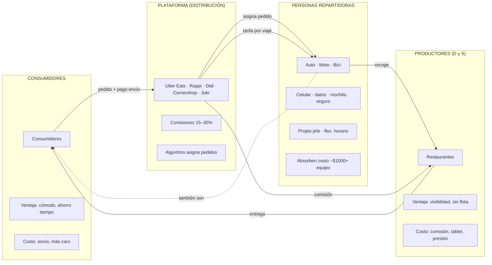
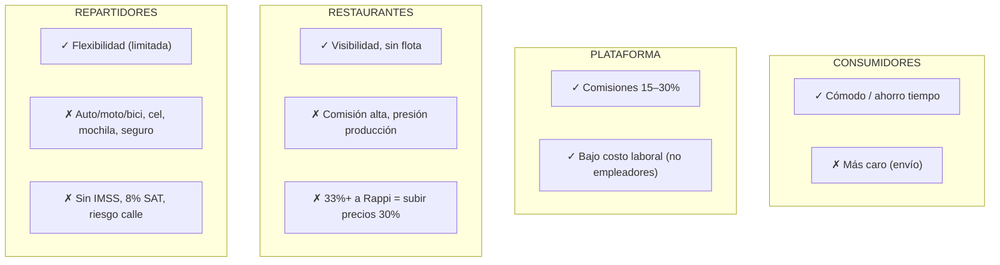
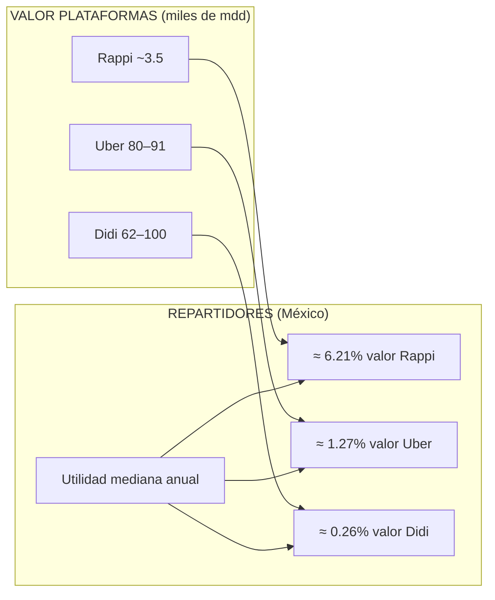

# Resumen: *Este futuro no aplica* — Gig economy y repartidores en CDMX

Resumen del reporte de **Oxfam México** e **Indesig** (2021) sobre condiciones laborales de personas repartidoras en plataformas digitales de alimentos en la Ciudad de México. Lectura: *Giceconomy* (gig economy / economía compartida).

---

## 1. Qué es la gig economy y el objeto del estudio

- **Gig economy (economía compartida):** sector donde se comercian bienes o servicios mediante **transacciones de bajo valor**, **puntuales** y por **canales digitales**. Quienes trabajan en él reciben pago por tarea o servicio, no un ingreso garantizado.
- **Modelo de negocio típico:** microtransacciones; una **plataforma** pone en contacto a **consumidores**, **repartidores** y **restaurantes**. Ejemplos en México: Uber Eats, Rappi, Didi Food, Cornershop, Jokr.
- **Objetivo del reporte:** documentar precarización y desigualdad en el sector del reparto de comida por apps en CDMX, con vistas a regulación y políticas que mejoren la distribución de beneficios.

### Metodología (detalle)

- **Encuesta ENPRA** (Encuesta para personas repartidoras de aplicaciones, condiciones y preferencias laborales): levantada en CDMX entre el **20 de agosto y el 20 de septiembre de 2021**. Cara a cara en **29 centros comerciales** de **14 alcaldías**, con muestreo por ubicación geográfica. Total **1 041** cuestionarios; tras validación, **986** con mayoría de preguntas respondidas.
- **Entrevistas:** **26** semiestructuradas a repartidores (15 hombres, 11 mujeres; 20–67 años; incl. madres jóvenes y adultos mayores) y **4** a pequeños restaurantes/micronegocios. Muestreo por bola de nieve en zonas de espera de pedidos. Septiembre 2021.
- Instrumentos en anexos del reporte (cuestionario cuantitativo y guías cualitativas).

---

## 2. Diagrama: actores y flujos de la gig economy

El siguiente esquema resume la relación entre consumidores, plataformas (distribución), productores de bienes/servicios (restaurantes) y el papel de las personas que reparten (que son a la vez demandantes de trabajo ante la plataforma).

**Idea clave:** La plataforma intermedia entre demanda (consumidores) y oferta (restaurantes + repartidores). Los costos de equipo, datos, seguro y riesgo recaen en las personas repartidoras; la plataforma captura comisiones de ambos lados (restaurante y, vía retención/estructura de pago, del trabajo de reparto).

---

## 3. El servicio: consumidores, restaurantes y repartidores

### Consumidores

- En México **~6.8 millones** de personas compraron alimentos/bebidas por internet en el último año; **~2 millones** en ZMVM (28.8 % del total; INEGI 2020).
- **Beneficios:** pedido rápido, oferta amplia, seguimiento en tiempo real, programar entrega; en lluvia evitan salir.
- **Costo:** envío variable por app (Uber Eats 19–25 pesos, Rappi 14–45, Didi 0–35, Cornershop 39–99, Jokr gratis según periodo). Precio final mayor que en restaurante.

### Restaurantes

- **Ventajas:** más canales de venta, reparto sin invertir en flota propia; clave en la pandemia (cierre de comedores). Visibilidad: clientes que no conocerían el local.
- **Desventajas:** comisiones altas y costos de activación. Véase tabla resumen:

| App        | Activación (ej.)      | Comisión al restaurante                          |
|-----------|------------------------|--------------------------------------------------|
| Uber Eats | 5 000 pesos (1er pedido; incl. tablet, fotos) | 15 % reparto propio; **30 %** repartidores Uber  |
| Didi Food | 0–3 500 pesos (CDMX gratis)                  | **30 %**                                         |
| Rappi     | Tablet 1 500 pesos (devolución si baja)      | 18 % entrega propia; **30 %** con plataforma     |
| Cornershop| Gratis                                        | **15 %** + IVA por pedido                        |

- **Cita del reporte (Restaurante Ramiro):** *“Nosotros vendemos una pizza en 390 pesos ¿por qué? Porque Rappi nos quita más del 33 %. Si la vendo en 300, le estoy dando casi 50 % de mi ganancia a Rappi. Lo que hacemos es subir 30 % cada precio; si no, trabajamos para Rappi y Uber Eats.”*
- ENOE: población ocupada en sector restaurantero **-17.4 %** 4T 2020 vs 4T 2019. Las apps mitigaron ventas pero no sustituyeron la caída; muchos pequeños trasladan la comisión al precio o no pueden integrar bien los pedidos esporádicos a la operación.

### Repartidores: qué aportan y qué absorben

- **Ventajas que prometen las apps:** horarios flexibles, propinas, promociones (ej. +120 pesos por 3 entregas en 2 h en Uber Eats), tarifa dinámica (28–75 pesos extra por pedido en pico). En promedio **~24 pesos por pedido** Uber Eats, **~34** Rappi (Finerio 2020); ~40 pesos/hora según ENPRA.
- **Desventajas:** no son empleados: sin prestaciones, seguridad social ni contrato. **Absorben:** medio de transporte (bici 35 %, moto 30 %, auto 25 % del reparto según app), celular y datos, **mochila** (200–900 pesos Uber Eats, ~800 Rappi; algunas apps la proveen o reintegran tras X pedidos), impermeable, **seguro** (si lo contratan, ~1 000 pesos/año; solo cubre durante viaje activo). Rappi: niveles (diamante, plata, bronce) que desbloquean más entregas pero generan presión “contra reloj”.
- **Lema “sé tu propio jefe”:** la independencia encubre precariedad y traslado de riesgos y costos al trabajador.

---

## 4. Diagrama: costos y beneficios por actor

---

## 5. El trabajo: motivaciones, ingresos y condiciones

### Motivaciones para entrar al reparto

- **37 %** desempleo; **26 %** complementar ingresos; **33 %** flexibilidad de horarios (por año de registro: 2021 concentra más desempleo).
- **Por género:** hombres → desempleo/complementar; mujeres → **flexibilidad 44 %** (vs 32 % hombres), ligada a trabajo de cuidados (ellas reportan **21 h** no remuneradas/semana vs **12** ellos).
- **Flexibilidad limitada:** mediana **6 días y 40 h/semana** incluso entre quienes entraron por flexibilidad. Si no se conectan 6–8 h “no caen pedidos”; en Rappi sin nivel diamante no se reserva zona y bajan asignaciones. *“Tu horario tú te lo pones”* pero en la práctica se compensa después si se destina tiempo a cuidados o estudios.
- **App con “mejores condiciones” (ENPRA):** Uber Eats 49 %, Rappi 34.2 %, Didi 12 %, otras/NC el resto.

### Ingresos y perfil socioeconómico

- **Utilidad semanal** (ingresos menos gastos de trabajo): promedio **2 085 pesos**, mediana **1 700** (~**53 pesos/hora** promedio, **40** mediana). **Ingresos brutos semanales** promedio 2 562 pesos, **gastos** 490 (combustible, mantenimiento, datos, etc.).
- Por debajo del **salario promedio semanal en CDMX** (2 208 pesos, ENIGH 2020).
- **Perfil de ingresos del hogar (ENPRA):** 38 % en 6 750 pesos/mes o menos; 37 % entre 6 751 y 10 300. **Escolaridad:** 58 % bachillerato o técnica, 24 % secundaria, 16 % profesional (en CDMX quien tiene profesional gana en promedio 3 353 pesos/semana vs 1 500 bachillerato y 1 202 secundaria).
- **Línea de pobreza (CONEVAL ago 2021, 3 775 pesos/mes per cápita):** si el **único** ingreso fuera este trabajo, **55 %** no la alcanzaría (**63 %** en mujeres). **70 %** tiene algún dependiente económico.
- **Gasto catastrófico:** **46 %** por accidente o enfermedad grave (incl. COVID-19); promedio **6 127 pesos** (~70 % de la utilidad mensual). **69 %** sin ningún tipo de seguro médico público o privado (gráfica 5 del reporte). **22 %** tiene otro empleo además del reparto.
- **Desigualdad interna (Gini 0.41):** el **decil I** de ingreso laboral disponible per cápita **421 pesos/mes**; el **decil X 14 280**. El 10 % más pobre tiene un ingreso **33 veces** menor que el 10 % más alto entre repartidores.

### Condiciones laborales

- **Lugar de trabajo:** la calle (intemperie, lluvia, tráfico). Equipo lo pone la persona; la **LFT** exige que lo provea el empleador.
- **Discriminación:** plazas (no pasar con mochila/casco, esperar en zonas de servicio, “bajar” pedidos cuando hay 5 o 10); trato despectivo en restaurantes y por seguridad de edificios (“deja la mochila”, registros largos); clientes (insultos “muertos de hambre”, miradas despectivas). **Mujeres:** acoso callejero y en entregas (clientes en ropa interior o desnudos, riesgo al entrar a edificios); algunas evitan zonas o van acompañadas (ej. con hija).
- **Fiscalidad:** repartidores declaran **8 %** al SAT; sectores minero (6.2–6.9 %), farmacéutico (1.3–5 %), manufacturero (1.2–5 %) pagan **menos** efectivo (International Tax Review). Además suelen pagar **contador** (~300 pesos/mes en testimonios); perciben que el gobierno cobra sin dar protección. Retención de IVA e ISR por las apps reduce aún más el ingreso disponible.
- **Grupos de apoyo:** WhatsApp entre repartidores para reparar motos, prestar llantas, entregar el pedido por otro para evitar sanción. **Pedidos imposibles:** ej. 19 pizzas en una moto; se resuelven entre pares.

### Riesgos

- **Accidentes (tránsito, lluvia):** sin cobertura de la app salvo durante “viaje activo”; si es al volver a casa o entre pedidos, no reportan por miedo o porque no aplica. Preocupación por entregar el pedido más que por la salud (testimonio Luan: atropello, celular dañado, “solo pensaba en entregar el pedido”). Algunas apps cobran el monto del pedido si no se entrega.
- **COVID-19:** **18 %** suspendió por “Quédate en casa”; **26 %** no vacunado al momento de encuesta; **21 %** se contagió. Gastos de bolsillo; en Didi Food bloqueo temporal de cuenta si positivo o cuarentena. Apoyos (Uber hasta 14 días ayuda, Didi hasta 28 días de ganancias) poco claros o insuficientes; kits (Rappi 200 000 geles/mascarillas para ~50 000 repartidores = 4 por persona).
- **Acoso (ENPRA):** clientes 11 %, negocios 6 % (mujeres 15 % desde negocios), personal app 1 %. **Mujeres:** acoso por clientes, negocios y a veces compañeros; normalización del riesgo (“ya ni modo, pasó y va a seguir pasando”).
- **Asaltos:** teléfono, efectivo, comida. Sin seguro que cubra bien equipo ni trayectos.

---

## 6. Diagrama: desigualdad — valor plataformas vs. ingresos repartidores

**Ilustración del reporte:** un impuesto a la riqueza de **3.5 %** a los cofundadores de Uber (Kalanick y Camp) podría financiar la **seguridad social de todas las personas repartidoras en México durante 5 años**.

---

## 7. Demandas de las personas repartidoras

- **Más valorado (ENPRA):** seguridad social (seguros médicos o de vida) **54 %**; prestaciones de ley **48 %**; mejorar comisiones o propinas **47 %**. No necesariamente solo vía Estado; muchos imaginan mecanismos ofrecidos por las empresas (opcional, “quien quiera lo pague”).
- **Seguridad vial:** ciclovías, respeto a ciclistas/motos, carriles para motos, cumplimiento de multas a autos que invaden ciclovías. *“Más ciclovías”* (Janet, 52).
- **Pago:** más por viaje o salario fijo (opiniones divididas: salario fijo podría quitar flexibilidad; otros lo prefieren). Que no retengan impuestos de propinas o que la retención no los deje “perdiendo”.
- **Herramientas:** opción de comprar moto/equipo a pagos; descuentos en talleres y refacciones.
- **Organización:** poca disposición a sindicatos; miedo a listas negras y a que en paros otros sigan trabajando y “les caigan más pedidos”. Desprestigio de sindicatos. Grupos de apoyo entre pares (WhatsApp) sí existen. El reporte plantea que la solución pasa por **protección social universal** o diseños flexibles, no solo por reconocimiento laboral clásico, para no perder la flexibilidad que valoran.

---

## 8. El negocio: valor de las plataformas y desigualdad

### Línea de tiempo (México)

- **2015:** Cornershop (primera app de reparto de alimentos).
- **2016:** Rappi (México = 50 % facturación Rappi Global); **octubre** Uber Eats (lanzamiento récord, ~40 pedidos/min en hora pico).
- **2019:** Didi Food (Guadalajara feb., CDMX nov.; en 6 meses +3 000 restaurantes, +600 000 descargas).
- **2021:** Jokr (CDMX; ofrece prestaciones de ley y motos eléctricas; ~200 empleados en bodegas y reparto).

### Valor y crecimiento

- **Uber:** 80–91 mil mdd (2019); compra Cornershop ~3 000 mdd; EBITDA entregas +32 % 2T 2021 vs 1T, +80 % vs 2T 2020. Uso de ~50 empresas en Holanda para reducir carga fiscal sobre miles de millones (Business Insider 2021). Convenio IMSS 2021 con Beat, Didi, Rappi, Uber: piloto afiliación como **trabajadores independientes** (la opción ya existía; no hay reconocimiento de relación laboral plena).
- **Didi:** 62–100 mil mdd; cotización NY y SIC México. Didi Food +200 % demanda repartidores en pandemia; ~50 000 socios repartidores en México.
- **Rappi:** ~3 500 mdd; 9 países, 205 ciudades; ingresos netos +98.41 % y margen neto +94.33 % en 2020. ~50 000 repartidores en México (dic 2020).
- **Estimación total México:** ~350 000 personas repartidoras (Uber 250 000 “colaboradores” para Uber+Cornershop, Rappi 50 000, Didi 50 000, etc.).

### Desigualdad y fiscalidad

- Repartidores pagan **8 %** (SAT); minería 6.2–6.9 %, farmacéutico 1.3–5 %, manufactura 1.2–5 %. Pagan **1.1–6.8 puntos más** que grandes sectores, sin seguridad social a cambio.
- **Frase del reporte:** *“¿Queremos premiar el emprendimiento de quienes pueden llevar a cabo una genial idea y vivir de ella cómodamente por el resto de sus vidas mientras otras personas se la juegan cada día para llenarles los bolsillos?”*

---

## 9. Conclusiones y recomendaciones

### Conclusiones

- Industria que “llegó para quedarse”: gran demanda y ganancias para plataformas; **costos sociales y económicos** recaen en **restaurantes** y **repartidores** (estos, el eslabón más precarizado).
- **Desconfianza:** hacia apps y hacia el gobierno (lejano, cobra impuestos sin garantizar derechos).
- **Discriminación y riesgos** (vialidad, acoso, salud) deterioran calidad del trabajo y de vida, en especial de mujeres.
- Hacen falta **políticas innovadoras:** protección social que no dependa solo del empleo formal del siglo XX; **agenda universal de protección social** que mantenga flexibilidad donde se valore y garantice derechos sin atar todo al tipo de contrato.

### Recomendaciones por actor

| Actor | Recomendaciones (resumidas) |
|-------|-----------------------------|
| **Aplicaciones** | Cumplir estándares OIT; presupuesto para acoso/violencia/discriminación; aseguramiento completo (no solo durante viaje); compensación justa por comisiones; soporte para todas las situaciones; prioridad a personas afectadas en accidentes. |
| **IMSS** | Avanzar en **reconocimiento de la relación laboral** para que plataformas aporten como empleadoras. |
| **Gobierno** | Diagnosticar y sancionar prácticas que vulneren derechos; reconocer trabajo remunerado justamente; espacios de estacionamiento; cumplir reglamentos (ciclovías); simplificar fiscalidad para no depender de contador. |
| **Consumidores y sociedad civil** | Preferir apps y establecimientos con remuneraciones dignas; respetar ciclovías; considerar condiciones climáticas; trato digno a repartidores. |

---

## 10. Tabla resumen: datos clave para el debate

| Tema | Dato o idea |
|------|-------------|
| Pobreza | 55 % no alcanzaría línea de pobreza si este fuera su único ingreso (63 % mujeres). |
| Seguridad social | 69 % sin ningún seguro médico. |
| Gasto catastrófico | 46 % con gasto por accidente/enfermedad; promedio 6 127 pesos (~70 % utilidad mensual). |
| Fiscalidad | Repartidores 8 %; minería/farma/manufactura 1.2–6.9 % efectivo. |
| Valor plataformas vs. ingresos | Utilidad anual mediana repartidores = 0.26–6.21 % del valor Rappi/Uber/Didi. |
| Desigualdad interna | Gini 0.41; decil I = 421 pesos/mes per cápita, decil X = 14 280 (33 veces más). |
| COVID-19 | 18 % suspendió por Quédate en casa; 26 % no vacunado; 21 % se contagió. |
| Cita | “¿Queremos premiar el emprendimiento [...] mientras otras personas se la juegan cada día para llenarles los bolsillos?” |

---

**Fuente:** Oxfam México e Indesig, *Este futuro no aplica. Condiciones laborales de las personas repartidoras en plataformas digitales de reparto de alimentos en la Ciudad de México*, 2021 (lectura Giceconomy.md).  
**Uso:** Economía política, trabajo, regulación, gig economy, desigualdad.
